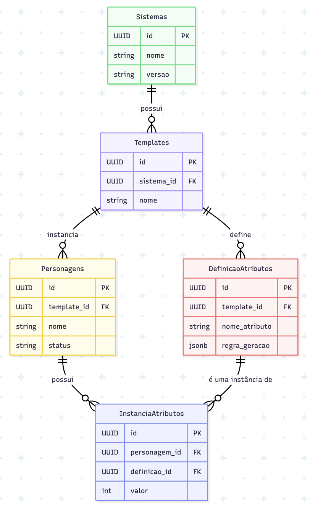
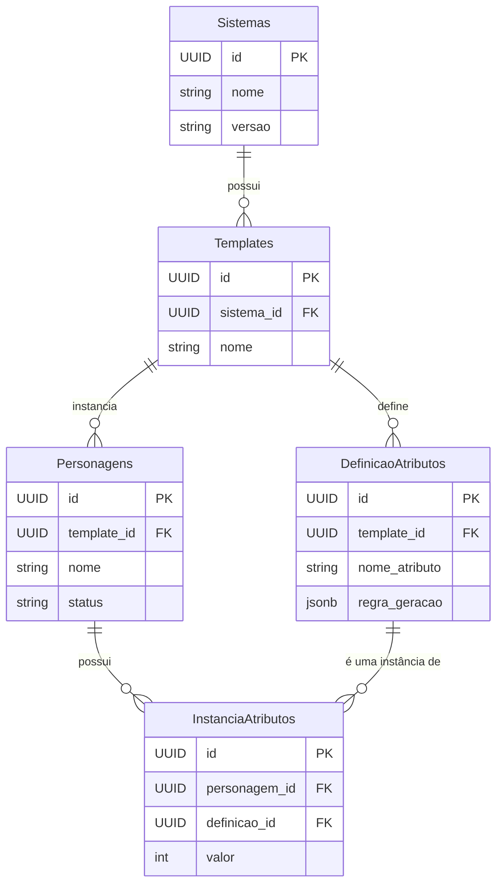

# Modelo de Dados (Data Model)

Este documento descreve a estrutura, o conteúdo e os relacionamentos do banco de dados do projeto RPG System.

##  filosofia

A arquitetura de dados deste projeto segue um princípio fundamental: **As regras do jogo não ficam no código, ficam nos dados.**

Isso significa que, em vez de programar a lógica de cada sistema de RPG (D&D, Vampiro, etc.) diretamente nos microsserviços, nós a descrevemos como dados estruturados (JSON) no banco de dados. Essa abordagem permite que o sistema seja extensível para suportar novos jogos sem a necessidade de alterar e reimplantar o código dos serviços.

Nossos microsserviços atuam como **executores de regras genéricos**, que leem essas definições do banco e as aplicam para construir os personagens.

## Diagrama de Entidade-Relacionamento (ER)

O [diagrama](https://mermaid.live/edit#pako:eNqtU01PAjEQ_SvNnIHwVYG9GYkJ8WKiXgwJGXaHtUrbTds1KvJnvPk7-GN2vwQWQQ_21nnz5r2ZaVcQ6oggADJjgbFBOVXMnxthHUm07P292dQrdksyWaIjywI2hURbm4opFLlbrEwe00IoEaI-d0bMU6cLVpSF6SjrmozVCmNSRbpQ1qEKBVaM3YSSM6ly9pX2_f1g5zR988lSiSwzsPnIYBbltmujWRX37NzdTcZMROz6ahuzvqaKmdKSDoLPvhXURXhdn8cvdfOYLUzMPHZ5SnN9dAR_UXGlpxMyMywrbtFHv6U5M-Rf0ywmg2Gt0909_pOLg6Dfq0vtnuwPy_6LelK5lXX9HI6qydZRoRx7xqU2pQloQGxEBIEzKTVAkpGYXSE3MQX3QL4PyD8KmqfsvWWcBNW91rKiGZ3GDxAscGn9LU0iP5fy436nkIrIXOhUOQhGeQUIVvACQa_bafFBp81HvMN7Q97tNeAVgj5vtc-6_cHZYMiHvN8erRvwlmu2W8MBX38B5SZJdQ) abaixo ilustra as principais entidades e como elas se conectam.





## Descrição das Entidades (Tabelas)

### Tabela: `Sistemas`
Armazena as informações do sistema de RPG em si. É a entidade de mais alto nível.

| Nome da Coluna | Tipo de Dado | Chave/Constraints | Descrição                                        |
| :------------- | :----------- | :---------------- | :----------------------------------------------- |
| `id`           | `UUID`       | Primary Key       | Identificador único para o sistema.              |
| `nome`         | `VARCHAR`    | NOT NULL          | O nome do jogo (ex: "Dungeons & Dragons 5e").    |
| `versao`       | `VARCHAR`    |                   | A versão específica do sistema (ex: "5e", "V20"). |

---

### Tabela: `Templates`
Representa um "molde" ou "receita" de ficha de personagem para um determinado `Sistema`.

| Nome da Coluna | Tipo de Dado | Chave/Constraints | Descrição                                                          |
| :------------- | :----------- | :---------------- | :----------------------------------------------------------------- |
| `id`           | `UUID`       | Primary Key       | Identificador único para o template.                               |
| `sistema_id`   | `UUID`       | Foreign Key       | Relaciona o template ao seu `Sistema` de jogo.                     |
| `nome`         | `VARCHAR`    | NOT NULL          | O nome do template (ex: "Ficha de Jogador Padrão", "Ficha de Monstro"). |

---

### Tabela: `DefinicaoAtributos`
O coração do nosso modelo. Define quais atributos um `Template` possui e, mais importante, **como** eles são gerados.

| Nome da Coluna    | Tipo de Dado | Chave/Constraints | Descrição                                                                                                                                                                                            |
| :---------------- | :----------- | :---------------- | :--------------------------------------------------------------------------------------------------------------------------------------------------------------------------------------------------- |
| `id`              | `UUID`       | Primary Key       | Identificador único para a definição do atributo.                                                                                                                                                    |
| `template_id`     | `UUID`       | Foreign Key       | Relaciona esta definição ao `Template` a que pertence.                                                                                                                                               |
| `nome_atributo`   | `VARCHAR`    | NOT NULL          | O nome do atributo (ex: "Força", "Destreza", "Raciocínio").                                                                                                                                          |
| `regra_geracao`   | `JSONB`      | NOT NULL          | **A lógica da geração do atributo, descrita em JSON.** O serviço executor irá ler este campo para saber o que fazer. Veja exemplos abaixo.                                                               |

#### Exemplos de `regra_geracao`:

**Para um atributo de D&D 5e ("rolar 4 dados de 6 lados e descartar o menor"):**
```json
{
  "metodo": "rolagem_dados",
  "parametros": {
    "quantidade_dados": 4,
    "lados_dado": 6,
    "descartar_menores": 1
  }
}
```

**Para um atributo de Vampiro: A Máscara ("compra por pontos com valor inicial 1"):**
```json
{
  "metodo": "compra_com_pontos",
  "parametros": {
    "valor_inicial": 1,
    "custo_por_ponto": 1,
    "limite_maximo": 5
  }
}
```

---

### Tabela: `Personagens`
Armazena uma instância de personagem que está sendo, ou já foi, gerada.

| Nome da Coluna | Tipo de Dado | Chave/Constraints | Descrição                                                                                              |
| :------------- | :----------- | :---------------- | :----------------------------------------------------------------------------------------------------- |
| `id`           | `UUID`       | Primary Key       | Identificador único para a instância do personagem.                                                      |
| `template_id`  | `UUID`       | Foreign Key       | Relaciona o personagem ao `Template` que foi usado como base.                                          |
| `nome`         | `VARCHAR`    |                   | O nome do personagem (pode ser gerado em etapas posteriores).                                          |
| `status`       | `VARCHAR`    | NOT NULL          | O estado atual do processo de geração (ex: `INICIADO`, `PROCESSANDO_STATS`, `COMPLETO`). |

---

### Tabela: `InstanciaAtributos`
Armazena o valor final e calculado de um atributo para um `Personagem` específico.

| Nome da Coluna  | Tipo de Dado | Chave/Constraints | Descrição                                                                        |
| :-------------- | :----------- | :---------------- | :------------------------------------------------------------------------------- |
| `id`            | `UUID`       | Primary Key       | Identificador único para a instância do atributo.                                |
| `personagem_id` | `UUID`       | Foreign Key       | Relaciona este valor ao `Personagem` correspondente.                             |
| `definicao_id`  | `UUID`       | Foreign Key       | Relaciona ao `DefinicaoAtributos` para sabermos qual atributo é (ex: "Força"). |
| `valor`         | `INTEGER`    | NOT NULL          | O valor final do atributo após a execução da `regra_geracao`.                  |


## Fluxo de Criação de Dados (Exemplo)

Para ilustrar como as tabelas se conectam na prática, veja o fluxo de uma solicitação de criação de personagem:

1.  **Requisição:** Uma chamada de API solicita a criação de um personagem usando um `template_id` específico (ex: o template de D&D 5e).
2.  **Criação do Personagem:** Um novo registro é criado na tabela `Personagens` com o `template_id` informado e um `status` inicial de `INICIADO`.
3.  **Processamento de Stats:** O `service-stats-generator` consome o evento. Ele usa o `template_id` do novo `Personagem` para buscar todas as `DefinicaoAtributos` relacionadas.
4.  **Execução da Regra:** Para cada definição, o serviço lê o JSON `regra_geracao` e executa a lógica correspondente (ex: rola os dados).
5.  **Criação da Instância:** Para cada atributo calculado, um novo registro é criado na tabela `InstanciaAtributos`, preenchendo o `personagem_id`, `definicao_id` e o `valor` final.
6.  **Continuação:** O processo continua para os próximos serviços (backstory, etc.), que podem adicionar mais dados ou atualizar o status do `Personagem`.

---

## Exemplo Prático de Leitura de Ficha

Para entender como a pontuação de um personagem é efetivamente armazenada e consultada, vamos seguir um exemplo prático de como o sistema montaria a ficha do personagem "Grog", um Bárbaro de D&D.

O objetivo é responder à pergunta: **"Qual é a pontuação de Força do Grog?"**

### Cenário Inicial

Imagine que as tabelas do banco de dados contêm os seguintes registros:

**Tabela `Personagens`:**
| id | template_id | nome | status |
| :--- | :--- | :--- | :--- |
| `uuid-grog` | `uuid-dnd-template` | Grog | COMPLETO |

**Tabela `DefinicaoAtributos` (O Formulário em Branco):**
| id | template_id | nome_atributo | regra_geracao |
| :--- | :--- | :--- | :--- |
| `uuid-forca` | `uuid-dnd-template` | Força | `{...}` |
| `uuid-destreza`| `uuid-dnd-template` | Destreza | `{...}` |

**Tabela `InstanciaAtributos` (Os Formulários Preenchidos):**
| id | personagem_id | definicao_id | valor |
| :--- | :--- | :--- | :--- |
| `uuid-inst-1`| `uuid-grog` | `uuid-forca` | **20** |
| `uuid-inst-2`| `uuid-grog` | `uuid-destreza`| 14 |

### Fluxo da Consulta

1.  **Encontrar o Personagem:** O sistema começa procurando na tabela `Personagens` pelo `nome` = "Grog". Ele encontra a linha com `id` = `uuid-grog`.

2.  **Encontrar as Pontuações do Personagem:** Em seguida, o sistema busca na tabela `InstanciaAtributos` por todas as linhas onde o `personagem_id` é `uuid-grog`. Ele encontra duas linhas (`uuid-inst-1` e `uuid-inst-2`).

3.  **Identificar o Atributo "Força":** Agora, o sistema precisa saber qual dessas pontuações corresponde à "Força".
    * Primeiro, ele busca na tabela `DefinicaoAtributos` pela linha onde `nome_atributo` = "Força" e `template_id` = `uuid-dnd-template` (o template do Grog). Ele descobre que o `id` da Força é `uuid-forca`.

4.  **Conectar a Pontuação ao Nome:** Com o `id` da Força em mãos (`uuid-forca`), o sistema volta para as pontuações do Grog que ele encontrou no passo 2 e procura a linha que possui o `definicao_id` correspondente.
    * Ele encontra a linha `uuid-inst-1`, que tem `personagem_id` = `uuid-grog` e `definicao_id` = `uuid-forca`.

5.  **Obter o Valor Final:** Finalmente, o sistema lê o campo `valor` dessa linha.

**Resultado:** A pontuação de Força do Grog é **20**.

Essa separação entre a **definição** de um atributo (o que ele é) e a sua **instância** (o valor que ele tem para um personagem específico) é o que torna o nosso sistema flexível para suportar qualquer RPG.