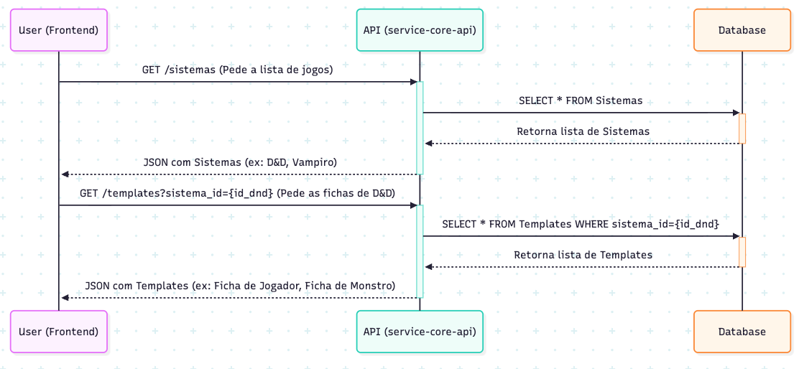
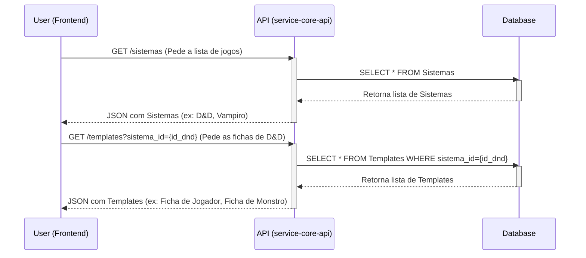
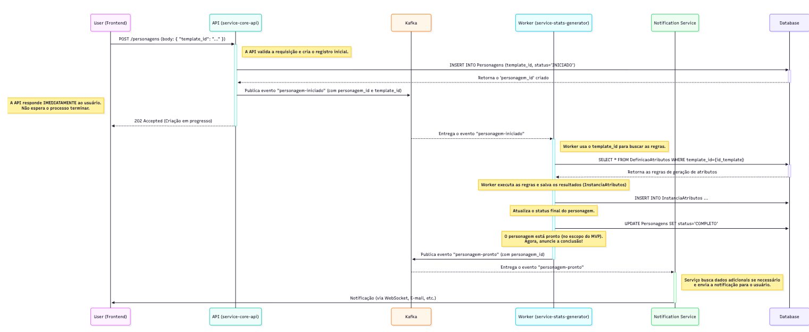
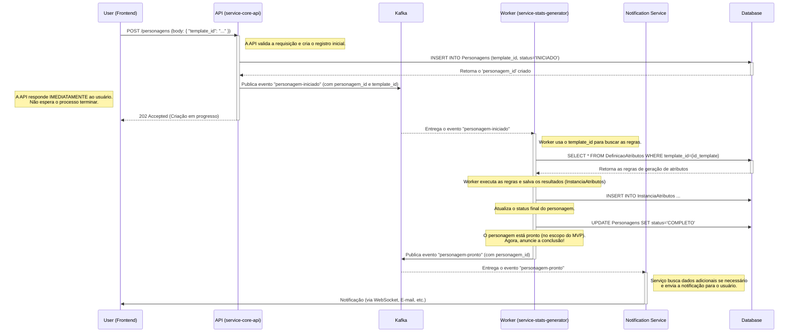

# Fluxo Principal: Criação de Personagem

Este documento detalha o fluxo completo de criação de um personagem, desde a interação inicial do usuário na interface até o processamento assíncrono pelos microsserviços e a notificação final ao usuário.

## Fase 1: Descoberta e Seleção (Interação do Usuário)

Nesta fase, o usuário escolhe qual tipo de personagem deseja criar. O processo é uma conversa entre o Frontend e a API principal (`service-core-api`), que consulta o banco de dados para apresentar as opções disponíveis.

[Para visualizar o primeiro diagrama no editor, clique aqui](https://mermaid.live/edit#pako:eNq1VF1v0zAU_StXfkAdSkrSJG1qiSG0psDE2NQWkFCkycR3raGxg-1Og6r_Hac0LXTthBDLS3w_fM659yhZkkJxJJQY_LZAWeBAsKlmZS7BPRXTVhSiYtLCe4MaWkOtpEXJT-43vLx6Ay3XdCsK9Aul0WeVONA3YJZ9ZgZz-au2B-yfnh5GovAqm8AzI4zFkhloXSFHYDB3CQbu-EVNldkQssKKW2bxQVWHa05AI5HCOHubnU3gKQxHlxcw3nDvcewmqtNN5D8wyQit0vI37X8iczyCfUSxY9rbIoXz8eU7KFS5hYYW3lEYPBl48IGVldDq5B7bsW39k1OOtZo7VPNi49m14M-Xgl9zyVeNfQZuRDFzLxc4bY9q36QRBB9fZ6MMDsj6_85uSR_B2t1Aa2-H9SZrznM1ZVxpb5e5UNLYv3eceGSqBSfU6gV6pERdsjokyxogJ3aGJeaEuiNn-mtOcrlyd9z3_Umpsrmm1WI6I_SGzY2LFhV3hJv_yzar3Uioz9RCWkI7adRdoxC6JHeE-mGn3Q3iKEq7cZik_Th15e-EhlGnHQb9Xi_sdpKo30mTlUd-rJmDdhr3e3EU9PpxnARJmKx-AonrlpU)

Ao final desta fase, o usuário selecionou um `template_id` específico, que será a chave para iniciar o processo de criação.

## Fase 2: Requisição, Orquestração e Notificação

Com o `template_id` em mãos, o usuário dispara a criação. A API inicia o processo e responde imediatamente. Em segundo plano, os microsserviços trabalham de forma assíncrona, orquestrados pelo Kafka, desde o processamento inicial até a notificação final de conclusão.

[Para visualizar o segundo diagrama no editor, clique aqui](https://mermaid.live/edit#pako:eNqdVutu2koQfpXp_gGOgHJpSGKdRrLA1UEtFwV6Ih1FqhZ7IavYu-7uGrVFPEzVH30QXuzM2kAdcAIKf8ze5pv5ZubbXRFfBow4RLOvCRM-63G6UDS6F4C_mCrDfR5TYeCzZgrKH5QUhomgcrzBHfehjJuW3Gc1XypWozEv2PeRzh_p8fSdVI8WYWdBG2p0bcEEU9RIVWBoKA2fc58aLgVMsmPHu3rU0BnVuJKtHcRRu7kpdtyB8WgyhbcxU1oKio5oKM9k8N2BFdwTw6I4pIZ94cE9cXCiXq_fE1hv_aS-4UtcfpaVbJuQuEXxxYMBOYfnHHHTlSUNeUCBgsJUcc03vze_JDDwFacgcXbBtVESuMDQaVjPEIptYtQ7XhzoDyfe7RQ_0xGM89HmYqyCzUei35f6w3637_ZGpcNI_xBtp3ej2gsE3zJMrLDOl_YsRwhWSmMKZGYpYM9AnAgwrTPMYjILsUiALZkwEhP1B6qWUYVABMq-jOCJF0htjoBKHjNNW8jmadYOCmqXLsV0LEXAoD_wen136g684dQDKiHRyean4rL-90y9vRmmWdQIbYmIlfSZ1hKhVcQFVS-nEcM8gm81WuD6PosNC6DcRSa3lRJZ6wtlzVeOqH25TlMuLdqpLnXAEwZL0cbyMuMH1XO6_Ys65rQ72x2Jth7l8mk1gsIs0T5VQLVtH0X1lu1TZp-0z8T75HWn8Bd8uB0NoMfmNkYqXaP4LDFSw90_3q2Xx36_4sGX3Xh9dhudDnbXUPt4MMOwwOWsAnBAd16d1Vsp2XKJoGcTzb4xPzF5FxhoGi6Rfjujk9Bg-lFc-gJtCCyGPVGVV5Cf165ji2BF-ZXxuCZBwf1hyyaTPsDE0hACmZOJ19TL53HPRSHIK-3Em-71tTsajD9501HptY6Pcv6hsJjNT9v3thPLwiqNL2Npoxj8O65kEuQupKJVoCJB9rBGwJfCDxONNfPm7ADPkNvMjUKxPRak894DB_JU9CQ4JUk7rw768PnXRZEQFQOnfza_ZaYzEKSVTwOUQMTmGjQDwazep_dBmgsGTCy5vebF1mTWu6lc5e6OzIki2KI7YfjEVtkC3LHZRPqPzFTBq0WUh1Vgxq8fJ6IIg1TJQvGAOEYlrEoivKyoHZKVPY6vowcWsexdFFD1aMld4xl8kP0nZbQ7pmSyeCDOnIYaR0kcINz2_bmfVRgAU12ZCEOc9lVqgzgr8o04rUaz3r6-6HSa7fZF67Jz0ayS78RpNi7qzcb1Zeeyc91qv7u-bK2r5EcK26hf4fhdu9G5ajWvWu1ma_0_KbbLDg)

### Conclusão do Fluxo

* A escolha de um **Sistema** e, principalmente, de um **Template** pelo usuário é o que define todo o contexto da criação.
* A arquitetura é **assíncrona**: a API confirma o recebimento da tarefa e o trabalho pesado é feito em segundo plano, garantindo uma experiência de usuário rápida e um sistema escalável.
* O evento final **`personagem-pronto`** é crucial. Ele desacopla o processo de criação da notificação ao usuário e permite que outras funcionalidades (como um gerador de PDF) sejam adicionadas no futuro de forma independente, apenas "ouvindo" o mesmo evento de conclusão.